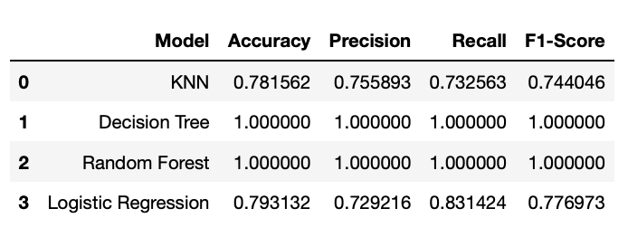
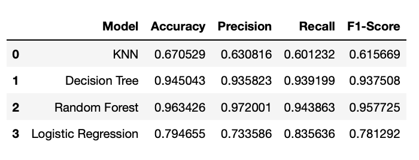
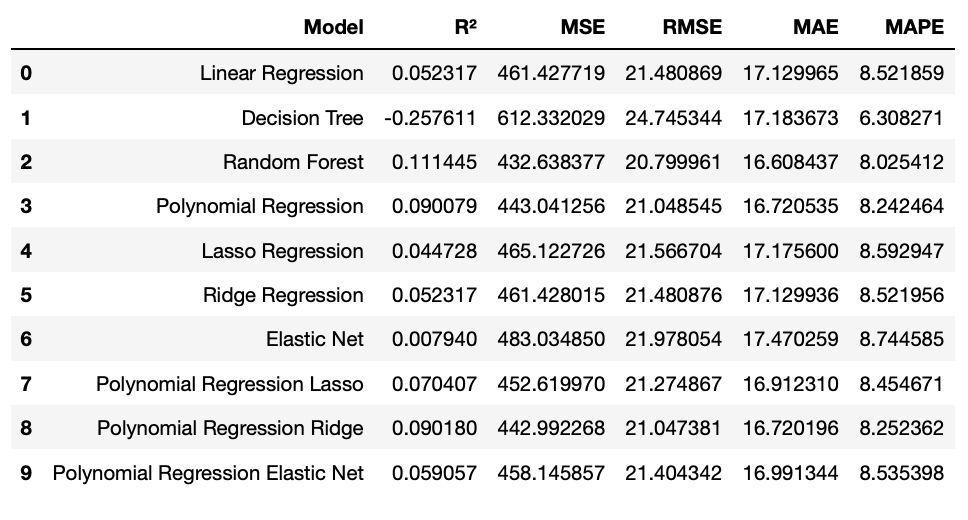

# Ensaio de Machine Learning

## Descrição
A empresa Data Money acredita que a expertise no treinamento e ajuste
fino dos algoritmos, feito pelos Cientistas de Dados da empresa, é a
principal motivo dos ótimos resultados que as consultorias vem
entregando aos seus clientes.

## Objetivo
O objetivo desse projeto será realizar ensaios com algoritmos de
Classificação, Regressão e Clusterização, para estudar a mudança do
comportamento da performance, a medida que os valores dos principais
parâmetros de controle de overfitting e underfitting mudam.

# Planejamento da solução

## Produto final
O produto final será 7 tabelas mostrando a performance dos algoritmos,
avaliados usando múltiplas métricas, para 3 conjuntos de dados
diferentes: Treinamento, validação e teste.

## Algoritmos ensaiados

### Classificação:
Algoritmos: KNN, Decision Tree, Random Forest e Logistic Regression
Métricas de performance: Accuracy, Precision, Recall e F1-Score

### Regressão:
Algoritmos: Linear Regression, Decision Tree Regressor, Random Forest
Regressor, Polinomial Regression, Linear Regression Lasso, Linear
Regression Ridge, Linear Regression Elastic Net, Polinomial Regression
Lasso, Polinomial Regression Ridge e Polinomial Regression Elastic Net
Métricas de performance: R2, MSE, RMSE, MAE e MAPE

### Agrupamento:
Algoritmos: K-Means e Affinity Propagation
Métricas de performance: Silhouette Score

## Ferramentas utilizadas
Python 3.10.4 e Scikit-learn

# Desenvolvimento

## Estratégia da solução
Para o objetivo de ensaiar os algoritmos de Machine Learning, eu vou
escrever os códigos utilizando a linguagem Python, para treinar cada um
dos algoritmos e vou variar seus principais parâmetros de ajuste de
overfitting e observar a métrica final.
O conjunto de valores que fizerem os algoritmos alcançarem a melhor
performance, serão aqueles escolhidos para o treinamento final do
algoritmo.

## O passo a passo
Passo 1: Divisão dos dados em treino, teste e validação.

Passo 2: Treinamento dos algoritmos com os dados de treinamento,
utilizando os parâmetros “default”.

Passo 3: Medir a performance dos algoritmos treinados com o parâmetro
default, utilizando o conjunto de dados de treinamento.

Passo 4: Medir a performance dos algoritmos treinados com o parâmetro
“default”, utilizando o conjunto de dados de validação.

Passo 5: Alternar os valores dos principais parâmetros que controlam o
overfitting do algoritmo até encontrar o conjunto de parâmetros apresente
a melhor performance dos algoritmos.

Passo 6: Unir os dados de treinamento e validação

Passo 7: Retreinar o algoritmo com a união dos dados de treinamento e
validação, utilizando os melhores valores para os parâmetros de controle
do algoritmo.

Passo 8: Medir a performance dos algoritmos treinados com os melhores
parâmetro, utilizando o conjunto de dados de teste.

Passo 9: Avaliar os ensaios e anotar os 3 principais Insights que se
destacaram.

# Os top 3 Insights

### Insight Top 1
Os algoritmos baseado em árvores possuem uma performance melhores
em todas as métricas, quando aplicados sobre os dados de teste, no
ensaio de Classificação.

## Insight Top 2
A performance dos algoritmos de classificação sobre os dados de
validação ficou bem próxima da performance sobre os dados de teste.

## Insight Top 3
Todos os algoritmo de regressão não apresentaram boas métricas de
performance, o que mostra uma necessidade de uma seleção de atributos
e uma preparação melhor das variáveis independentes do conjunto de
dados.

# Resultados

## Ensaio de classificação:

### Sobre os dados de treinamento

### Sobre os dados de validação

### Sobre os dados de teste

## Ensaio de regressão:

### Sobre os dados de treinamento

### Sobre os dados de validação

### Sobre os dados de teste

## Ensaio de clusterização:

# Conclusão
Nesse ensaio de Machine Learning, consegui adquirir experiência e
entender melhor sobre os limites dos algoritmos entre os estados de
underffiting e overfitting.
Algoritmos baseados em árvores são sensível quanto a profundidade do
crescimento e do número de árvores na floresta, fazendo com que a
escolha correta dos valores desses parâmetros impeçam os algoritmos de
entrar no estado de overfitting.
Os algoritmos de regressão, por outro lado, são sensíveis ao grau do
polinômio. Esse parâmetro controla o limite entre o estado de underfitting
e overfitting desses algoritmos.
Esse ensaio de Machine Learning foi muito importante para aprofundar o
entendimento sobre o funcionamento de diversos algoritmos de
classificação, regressão e clusterização e quais os principais parâmetros
de controle entre os estados de underfitting e overfitting.

# Próximos passos
Como próximos passos desse ensaio, pretendo ensaiar novos algoritmos
de Machine Learning e usar diferentes conjuntos de dados para aumentar
o conhecimento sobre os algoritmos e quais cenários são mais favoráveis
para o aumento da performance dos mesmos.
